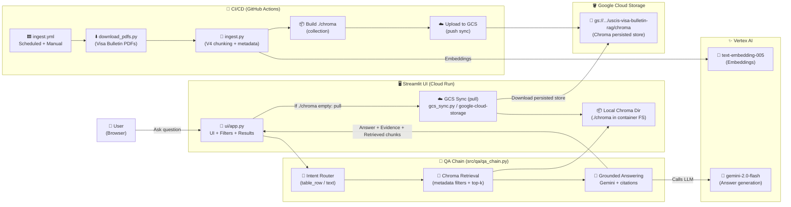
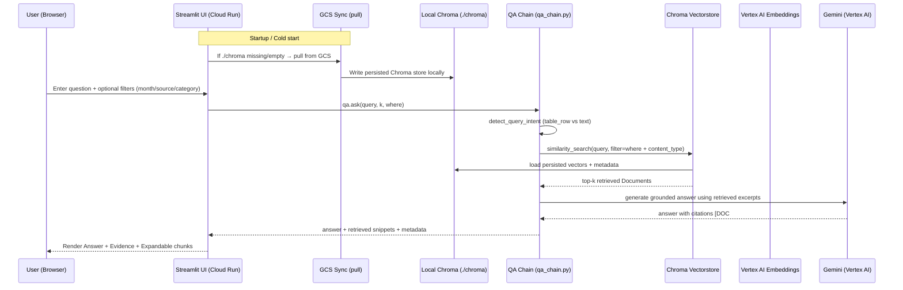
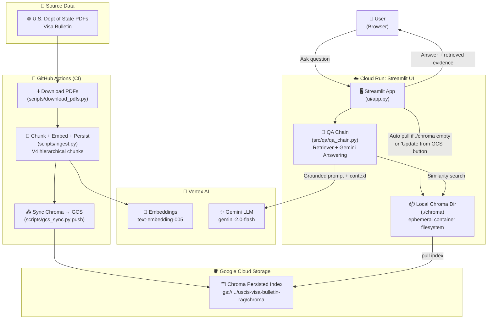
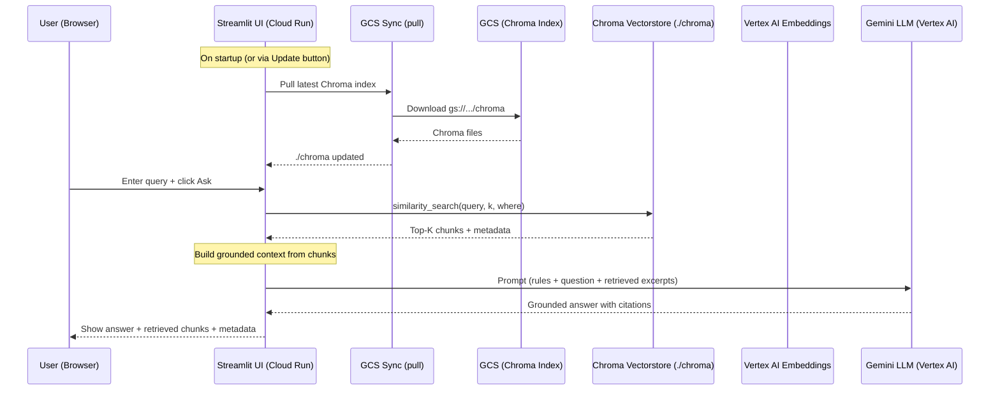

# USCIS Visa Bulletin RAG

A production-grade cloud-native **Retrieval-Augmented Generation (RAG)** system for querying USCIS Visa Bulletin PDFs using **Vertex AI (Gemini)**, **Chroma**, **Streamlit**, **Cloud Run**, and **GitHub Actions**.

👉 **Live Demo:**  
https://uscis-visa-bulletin-rag-ui-947807269152.us-central1.run.app/

👉 Demo URL is provided for convenience; availability depends on cloud billing and quotas.

## 🚀 What This Project Does

- 📄 **Automatically downloads** monthly USCIS Visa Bulletin PDFs
- 🧠 **Parses & chunks documents hierarchically** (sections + tables + rows)
- 🔎 **Indexes structured chunks into Chroma** with rich metadata
- ☁️ **Persists embeddings to Google Cloud Storage (GCS)**
- 💬 **Answers natural-language questions** using Gemini with grounded citations
- 🔁 **Keeps data fresh** via a scheduled GitHub Actions ingestion pipeline
- 🌐 **Serves users via Streamlit on Cloud Run** (stateless, scalable)

---
## 💡 Why This Matters

- USCIS Visa Bulletins are highly structured but difficult to query programmatically
- This system enables accurate, citation-backed answers without manual lookup
- The same architecture generalizes to legal, compliance, and policy documents
---

## 🏗️ Architecture Diagram

**Important distinction**

- Ingestion pipeline → automated (CI/CD) document refresh + indexing
- Query runtime → user-facing retrieval + grounded answering
  

---
## 🏗️ Execution Sequence (End-to-End)


**Key Notes**
- GitHub Actions updates the vectorstore on a schedule (downloads PDFs → chunks → embeddings → persist → upload to GCS)
- Cloud Run is stateless: the container pulls Chroma from GCS when needed
- Queries use metadata filters (source, month, category) + semantic similarity
- Gemini is used only for grounded natural-language answering from retrieved excerpts (not for generating dates)

---

## 📁 Project Structure
```text
uscis-visa-bulletin-rag/
├── src/
│   └── qa/
│       ├── __init__.py            # Package marker
│       └── qa_chain.py            # QA chain: retrieval + grounding + Gemini answer
│
├── ui/
│   └── app.py                     # Streamlit UI (Cloud Run ready)
│                                  # • Auto-pulls Chroma from GCS on first run
│                                  # • Manual “Update from GCS” sync button
│
├── scripts/
│   ├── download_pdfs.py           # Download USCIS Visa Bulletin PDFs
│   ├── ingest.py                  # Ingestion pipeline (V4 chunking → embeddings → Chroma)
│   └── gcs_sync.py                # Sync Chroma ↔ GCS (push / pull)
│
├── .github/
│   └── workflows/
│       └── ingest.yml             # GitHub Actions: scheduled/manual ingestion → upload Chroma to GCS
│
├── notebooks/
│   └── uscis_visa_bulletin_rag.ipynb  # Exploratory / prototyping notebook
│
├── .env.example                   # Environment variable template
├── .gitignore                     # Ignores .env, chroma/, data/, .venv, caches, OS files
├── .dockerignore                  # Keeps Cloud Run images lean
├── .python-version                # Python version pin (uv / pyenv compatible)
│
├── Dockerfile                     # Cloud Run container (Streamlit on PORT=8080)
├── pyproject.toml                 # uv project config & dependencies
├── uv.lock                        # Fully locked, reproducible dependencies
├── README.md                      # Project overview, architecture, setup, CI/CD, deployment
└── main.py                        # (Optional) helpers / local entrypoint
```
---
## 🔄 End-to-End Pipeline (From Raw PDFs to Live Q&A)

This project implements a **production-grade, cloud-native RAG pipeline** for USCIS Visa Bulletins — covering ingestion, vector storage, synchronization, and live querying via a web UI.

---

### 1️⃣ Data Ingestion (Offline / CI-Driven)

**Trigger**
- Manually via GitHub Actions
- Or on a schedule (e.g., monthly bulletin updates)

**Steps**
1. **Download PDFs**
   - `scripts/download_pdfs.py` fetches official USCIS Visa Bulletin PDFs directly from the U.S. Department of State website.
2. **Parse & Chunk (V4 Strategy)**
   - PDFs are parsed and split using a **hierarchical chunking strategy**:
     - Document → Section → Sub-section
   - Preserves semantic structure for higher retrieval accuracy.
3. **Embedding**
   - Each chunk is embedded using **Vertex AI text embeddings** (`text-embedding-005`).
4. **Vector Store Creation**
   - Embeddings + metadata are stored in **ChromaDB** (local persist directory).

**Output**
- A fully built **Chroma vector index** containing USCIS visa bulletin knowledge.

---

### 2️⃣ Persistence Layer (GCS as the Source of Truth)

After ingestion:
- The local Chroma directory is **synced to Google Cloud Storage (GCS)**.
- GCS acts as the **durable, centralized vector store**.

**Why GCS?**
- Cloud Run containers are **stateless**
- GCS enables:
  - Fast startup
  - Shared access across deployments
  - Zero reliance on local disks

**Tooling**
- `scripts/gcs_sync.py`
  - `push`: Upload Chroma → GCS
  - `pull`: Download Chroma ← GCS

---

### 3️⃣ Runtime Initialization (Cloud Run / Local UI)

When the UI starts (locally or on Cloud Run):

1. **Startup Check**
   - If `./chroma` does not exist:
     - Automatically **pulls the latest Chroma index from GCS**
2. **QA Chain Initialization**
   - Loads:
     - Chroma vector store
     - Retriever
     - Gemini QA chain
3. **App Ready**
   - UI becomes interactive only after the knowledge base is available

This ensures:
- `git clone → run → ask questions` works with **zero manual setup**

---

### 4️⃣ Live Question Answering (Online)

**User Flow**
1. User enters a natural-language query in the Streamlit UI
2. System:
   - Retrieves top-K relevant chunks from Chroma
   - Grounds the prompt with retrieved context
   - Sends it to **Gemini (Vertex AI)** for answer generation
3. Final answer is returned with **hallucination-safe grounding**

**Optional Runtime Control**
- UI includes an **“Update from GCS”** button:
  - Pulls the latest Chroma index
  - Clears cached QA state
  - Re-initializes the retriever instantly

---

### 5️⃣ CI + CD Separation of Concerns

| Layer | Responsibility |
|-----|---------------|
| GitHub Actions | Ingestion, embedding, GCS sync |
| Google Cloud Storage | Persistent vector storage |
| Cloud Run | Stateless UI + inference |
| Streamlit | User interaction |
| Vertex AI | Embeddings + LLM inference |

This clean separation mirrors **real enterprise GenAI architectures**.

---

### ✅ Why This Pipeline Matters

- Production-grade RAG (not a demo notebook)
- Stateless compute with durable storage
- CI-driven knowledge updates
- Cloud Run–ready architecture
- Enterprise-scalable design pattern

This same pipeline can be reused for:
- Legal and policy documents
- Immigration or compliance workflows
- Financial filings
- Internal enterprise knowledge bases
---


## 🏗️ Architecture Diagram (End-to-End Pipeline)


## 🏗️ Execution Sequence (Runtime Q&A)

---

## 🛠️ Prerequisites

### Local Development
- **Python 3.11+** (recommended via `.python-version`)
- **[`uv`](https://github.com/astral-sh/uv)** – fast Python package & environment manager
- **Git**
- **Google Cloud SDK (`gcloud`)** authenticated locally  
  ```bash
  gcloud auth application-default login
  ```
### Google Cloud Platform - A GCP project with:
- **Vertex AI API enabled**
- **loud Run enabled**
- **Cloud Build enabled**
- **Cloud Storage enabled**
- **Access to Gemini models on Vertex AI**
- **A GCS bucket for persisting Chroma vector indexes**

### GitHub (CI/CD) - A GitHub repository with:
- **GitHub Actions enabled**
- **Workload Identity Federation (WIF) configured for secure GCP access**
- **Required GitHub Secrets:**
- **GOOGLE_CLOUD_PROJECT**
- **GOOGLE_CLOUD_REGION**
- **GCP_SERVICE_ACCOUNT**
- **GCP_WIF_PROVIDER**
- **GCS_CHROMA_PATH**

### Runtime (Cloud Run)
- **A service account with:**
- **roles/storage.objectAdmin on the Chroma GCS bucket**
- **roles/aiplatform.user on the GCP project**
- **Cloud Run service configured to:**
- **Listen on PORT=8080**
- **Run in stateless mode (Chroma pulled from GCS on startup)**

---
## ⚙️ Setup Instructions

Follow these steps to run the **USCIS Visa Bulletin RAG** system locally.

This setup is designed so that **anyone cloning the repo can run the UI with minimal friction**, while still matching the production (Cloud Run + GCS + Vertex AI) architecture.

---

### 1️⃣ Clone the repository

```bash
git clone https://github.com/AvinashBolleddula/uscis-visa-bulletin-rag.git
cd uscis-visa-bulletin-rag
```

### 2️⃣ Create and activate a virtual environment
This project uses uv for fast and reproducible Python environments.
```bash
uv venv
source .venv/bin/activate
```
You should now see (.venv) in your terminal prompt.

### 3️⃣ Install dependencies
Install all required dependencies exactly as defined in pyproject.toml and uv.lock.
```bash
uv sync
```
### 4️⃣ Configure environment variables
Create a .env file inside the weather/ directory:
```bash
GOOGLE_CLOUD_PROJECT=your-gcp-project-id
GOOGLE_CLOUD_REGION=us-central1

# Models
QA_LLM_MODEL=gemini-2.0-flash
EMBED_MODEL_ID=text-embedding-005

# Chroma
CHROMA_COLLECTION=visa_bulletins_v4_hierarchical
CHROMA_PERSIST_DIR=./chroma

# GCS (used for syncing vector store)
GCS_CHROMA_PATH=gs://your-bucket-name/uscis-visa-bulletin-rag/chroma
```
Note
Vertex AI uses IAM authentication, not API keys
Ensure you are authenticated locally using:
```bash
gcloud auth application-default login
```
### 5️⃣ Optional) Ingest data locally
⚠️ In production, ingestion runs via GitHub Actions
You only need this step if you want to test ingestion locally.
```bash
# Download visa bulletin PDFs
uv run python scripts/download_pdfs.py --year 2025 --all

# Ingest PDFs → chunks → embeddings → local Chroma
uv run python scripts/ingest.py \
  --data-dir data \
  --persist-dir ./chroma \
  --collection visa_bulletins_v4_hierarchical \
  --embed-model text-embedding-005 \
  --wipe
```

### 6️⃣ Sync Chroma from GCS (recommended)
If your Chroma index already exists in GCS (recommended path):
```bash
uv run python scripts/gcs_sync.py \
  --mode pull \
  --local ./chroma \
  --gcs "$GCS_CHROMA_PATH"
```
This mirrors production behavior and avoids re-ingestion.

### Run the Streamlit UI locally
```bash
uv run streamlit run ui/app.py
```
You should see output similar to:
```bash
Local Chroma not found. Syncing from GCS...
QA system initialized successfully
```
Open your browser at:
```bash
http://localhost:8501
```

## Ask questions 🎯
### Example query:

- **“F2A Final Action Date for Mexico November 2025”**

### The system will:
- **1.	Retrieve relevant chunks from Chroma**
- **2.	Apply metadata filters if provided**
- **3.	Generate an answer using Gemini (Vertex AI)**
- **4.	Show citations and retrieved context**

### ✅ What You Now Have
- **Fully working local RAG system**
- **Same behavior as Cloud Run production**
- **Stateless design (safe restarts, reproducible runs)**
- **CI/CD-ready ingestion pipeline**

### You are now ready to:
- **Deploy to Cloud Run**
- **Extend to FastAPI**
- **Add auth, rate limits, or multi-tenant support 🚀**


